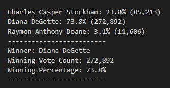

# Election_Analysis
## Overview 
In the Election Analysis project we were tasked with analysing election results to determine the participating counties, candidate outcomes and the winning candidate vote counts. We put together a script in VS Code to comb through our python fyle and output our results. 
## Election Audit Results 
* We needed to first gather the total votes that were casted. By creating the following for loop we were able to determine the total votes were **369,711**

```
for row in reader:

        total_votes = total_votes + 1

```

* We then needed to gather the county voter turnout and print the breakdown. The following code allows us to print the details in a txt file, which is shown below. 

```
with open(file_to_save, "w") as txt_file:
   
    election_results = (
        f"\nElection Results\n"
        f"-------------------------\n"
        f"Total Votes: {total_votes:,}\n"
        f"-------------------------\n\n"
        f"County Votes:\n")
    for key, values in county_votes.items ():
        percentage = round(values / total_votes *100, 1)
        line = key + ": " + str(percentage) + "%" + " (" + str(total_votes) + ")" + "\n"
        election_results += line 
    election_results += f"-------------------------\n\n"
    print(election_results, end="")

    txt_file.write(election_results)
    
 ```
 


* Finally, we needed to gather the candidate results and print the details of the winner. The following code allows us to do so, and print the results that are shown in our image below:

```
for candidate_name in candidate_votes:

        votes = candidate_votes.get(candidate_name)
        vote_percentage = float(votes) / float(total_votes) * 100
        candidate_results = (
            f"{candidate_name}: {vote_percentage:.1f}% ({votes:,})\n")

        print(candidate_results)

        txt_file.write(candidate_results)

        if (votes > winning_count) and (vote_percentage > winning_percentage):
            winning_count = votes
            winning_candidate = candidate_name
            winning_percentage = vote_percentage
  
```



## Election Audit Summary 
In this project we were able to tally the total votes, the county voter turnout, and compare the candidate results. It was a great way to analyze the results for this election, but the script could be very helpful with other elections as well. The for loops and if conditions that were used in this script could be used as a base for any election. It simply loops through the various counties and candidates pulling the data that's needed to analyze the results. You could use similar code to pull additional details as well. 

